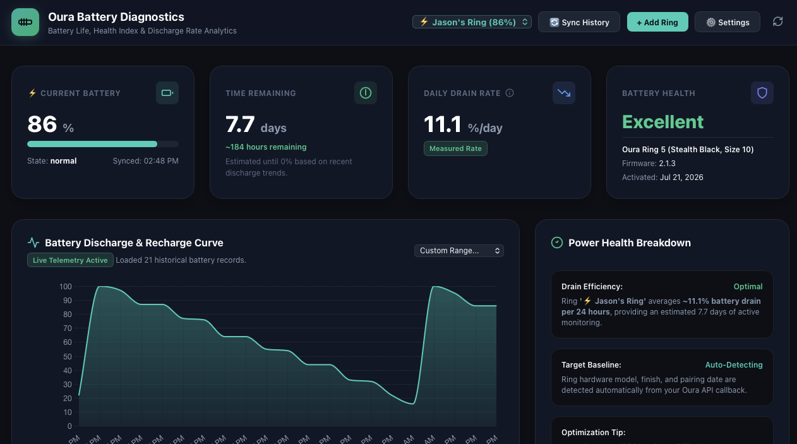

# Oura Ring Battery Health & Power Tracker

<p align="center">
  
  
  
  
  
</p>

A specialized, lightweight web application built to monitor, analyze, and diagnose **Oura Ring battery health, discharge rates, and recharge cycles**. Yes, this was vibe-coded. No, I don't care if you hate me for it. 

---

## 📸 Screenshots

| Main Dashboard & Battery Metrics | 
| :---: | 
|  | 

---

## ✨ Features

- **⚡ Real-Time Battery State**: Displays live battery percentage, charging state (`normal`, `low`, `charging`, `full`), hardware generation, and firmware version.
- **📊 Daily Discharge Rate Analytics**: Calculates actual daily battery consumption (`%/day`) based on rolling historical sync logs.
- **⏳ Remaining Runtime Estimator**: Accurately projects remaining battery life in hours and days before reaching 0%.
- **🩺 Battery Cell Health Rating**: Evaluates degradation by comparing actual daily drain against nominal baselines (12-15%/day for ~7-day runtime).
- **📈 Discharge & Recharge Curves**: Interactive Chart.js graphs displaying continuous battery level history over 7, 14, or 30 days, highlighting recharge events.
- **💍 Multi-Ring Support**: Manage and monitor multiple Oura rings simultaneously with custom labels, emojis, color tags, purchase dates, and individual target runtimes.
- **🔌 Charge Event Tracking**: Automatically logs start/end battery percentages, charge duration (minutes), and charge frequency.
- **🛡️ 100% Self-Hosted & Private**: Runs locally on your machine, server, or Docker container with persistent SQLite storage (`oura_tracker.db`).

---

## 🚀 Quick Start

### Option A: Using Docker & Docker Compose (Recommended)

1. **Clone the repository**:
   ```bash
   git clone https://github.com/cipriani14/oura-ring-battery-health-tracker.git
   cd oura-ring-battery-health-tracker
   ```

2. **Set up Environment Variables**:
   ```bash
   cp .env.example .env
   ```
   Edit `.env` and paste your Oura Personal Access Token:
   ```env
   OURA_PAT=your_oura_personal_access_token_here
   ```

3. **Launch Container**:
   ```bash
   docker compose up -d --build
   ```

4. **Open Web Dashboard**:
   Navigate to [http://localhost:8899](http://localhost:8899) in your browser.

---

### Option B: Running Locally with Python (Without Docker)

1. **Clone the repository**:
   ```bash
   git clone https://github.com/cipriani14/oura-ring-battery-health-tracker.git
   cd oura-ring-battery-health-tracker
   ```

2. **Create a Virtual Environment**:
   ```bash
   python3 -m venv venv
   source venv/bin/activate  # On Windows: venv\Scripts\activate
   ```

3. **Install Dependencies**:
   ```bash
   pip install -r requirements.txt
   ```

4. **Configure Environment File**:
   ```bash
   cp .env.example .env
   ```
   Edit `.env` to include your `OURA_PAT`.

5. **Start Application**:
   ```bash
   uvicorn app.main:app --host 0.0.0.0 --port 8000
   ```

6. **Access Dashboard**:
   Open [http://localhost:8000](http://localhost:8000) in your browser.

---

## 🔑 How to Get an Oura Personal Access Token (PAT)

To allow the app to fetch your ring's battery metrics:

1. Log into your account at [cloud.ouraring.com/personal-access-tokens](https://cloud.ouraring.com/personal-access-tokens).
2. Click **Create New Token**.
3. Give it a label (e.g. `Oura Battery Tracker`).
4. Copy the generated token string and add it to your `.env` file or directly in the app's **Ring Devices** UI settings.

---

## 📁 Environment Variables Reference

| Variable | Default Value | Description |
| :--- | :--- | :--- |
| `OURA_PAT` | *(None)* | Default Oura Personal Access Token for the primary ring |
| `DATABASE_URL` | `sqlite:///./oura_tracker.db` | Connection string for SQLite persistent storage |
| `POLL_INTERVAL_MINUTES` | `60` | Background polling frequency for Oura API (in minutes) |
| `HOST` | `0.0.0.0` | Host bind address for Uvicorn |
| `PORT` | `8000` | Port number for Uvicorn server |

---

## 💻 What Else You Need to Know & Hosting Options

### 1. 24/7 Polling & Background Sync
Because Oura syncs battery updates when your phone connects to the ring, the app continuously polls the Oura API every hour (`POLL_INTERVAL_MINUTES=60`). For continuous historical tracking:
- **Local Machine**: Keep the Python process or Docker container running in the background.
- **Home Server / NAS**: Excellent candidate for home servers running **Unraid**, **Raspberry Pi**, **Synology**, or **Home Assistant** via Docker.
- **Free/Low-Cost Cloud Hosting**: You can deploy this app to platforms like **Render**, **Railway**, **Fly.io**, or any cheap VPS ($3-5/mo) by setting your environment variables in their control panel.

---

## 🛠️ Tech Stack

- **Backend**: FastAPI (Python 3.11), SQLAlchemy, Uvicorn
- **Database**: SQLite
- **Frontend**: Jinja2 Templates, Vanilla CSS, Tailwind CSS, Chart.js
- **Containerization**: Docker, Docker Compose

---

## 📄 License

This project is licensed under the [MIT License](LICENSE).
